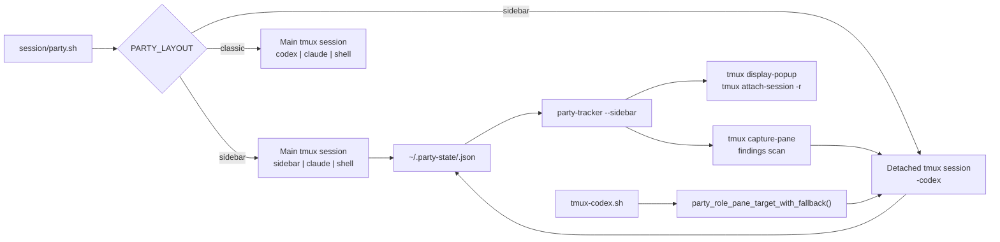
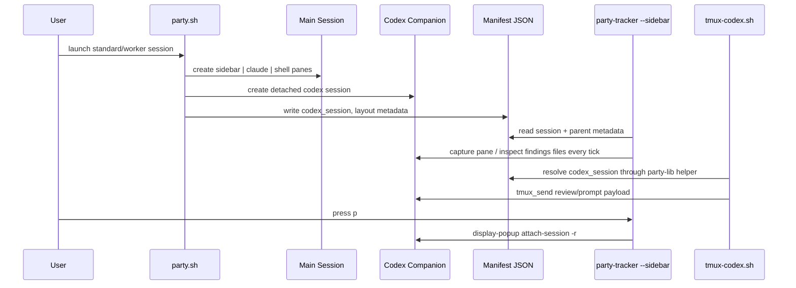

# Party Sidebar TUI V2 Design

> **Specification:** [SPEC-sidebar-tui-v2.md](./SPEC-sidebar-tui-v2.md)

## Architecture Overview

Standard and worker sessions keep a single visible tmux window with three panes, but pane `0.0` becomes a Bubble Tea sidebar instead of a live Codex pane. Codex itself moves into a detached companion session named `<party-id>-codex`, with the parent manifest storing that session name in `codex_session`. Routing, peek, and sidebar polling all resolve through that manifest-backed companion reference while master sessions continue to use the existing tracker path untouched.



## Existing Standards (REQUIRED)

| Pattern | Location | How It Applies |
|---------|----------|----------------|
| Role-based pane discovery | `session/party-lib.sh:397-503` | Companion routing must keep using `@party_role` resolution and extend it rather than inventing a second transport path |
| Atomic manifest writes with lock directories | `session/party-lib.sh:44-63`, `session/party-lib.sh:67-144`, `session/party-lib.sh:146-200` | New `codex_session` metadata must be persisted through existing manifest helpers, not ad hoc `jq` calls |
| Worker/master session launch shape | `session/party.sh:86-158`, `session/party-master.sh:46-83` | Sidebar launch must preserve current launcher conventions, pane metadata, and master-session behavior |
| Session discovery from tmux or scan fallback | `session/party-lib.sh:295-332` | Companion sessions must be excluded from user-facing discovery so hidden Codex sessions do not create ambiguity |
| Picker/list grouping by manifest metadata | `session/party-picker.sh:21-126`, `session/party.sh:396-438` | Companion sessions must remain invisible in list and picker flows, while workers and masters keep their current grouping |
| Bubble Tea refresh loop and narrow-width helpers | `tools/party-tracker/main.go:71-79`, `tools/party-tracker/main.go:243-250`, `tools/party-tracker/main.go:252-358` | Sidebar mode should reuse the existing polling cadence and width guards rather than building a second rendering loop |
| Tracker shell-action wrapper pattern | `tools/party-tracker/actions.go:10-69` | Peek and any sidebar-triggered shell actions should remain thin `exec.Command` wrappers rooted through `PARTY_REPO_ROOT` |
| Shell-test assertion style with mocked tmux | `tests/test-party-routing.sh:11-38`, `tests/test-party-master.sh:11-20` | Routing and lifecycle regressions should extend the current shell test suite style instead of introducing a new framework |

**Why these standards:** The session layer already centers on manifest-backed metadata and role-based routing, so extending those contracts minimizes breakage. The tracker already solves Bubble Tea polling and narrow rendering, which is cheaper and safer than a separate TUI binary. Existing shell tests cover tmux-heavy behavior without mocking the entire launcher stack, so the feature should extend that harness.

## File Structure

```text
session/
├── party.sh                     # Modify: sidebar/classic launch, companion lifecycle, visible-session filtering hooks
├── party-lib.sh                 # Modify: companion-aware routing, liveness helpers, visible-session helpers
├── party-picker.sh              # Modify: exclude hidden companions from picker output
└── party-master.sh              # Optional Modify: share tracker command resolution if extracted

claude/skills/codex-transport/scripts/
└── tmux-codex.sh                # Verify integration path; direct edits only if error text needs clarification

tools/party-tracker/
├── main.go                      # Modify: CLI parsing, sidebar mode branch, key handling
├── workers.go                   # Modify: richer manifest/session reads if reused by sidebar mode
├── actions.go                   # Modify: Codex peek popup action
├── sidebar.go                   # New: sidebar layout/rendering and flash-message support
├── codex.go                     # New: companion polling, findings parsing, offline handling
└── codex_test.go                # New: parser/unit tests

tests/
├── test-party-routing.sh        # Modify: companion routing and ROLE_NOT_FOUND semantics
├── test-party-companion.sh      # New: launch/cleanup/bulk-stop/discovery coverage
└── run-tests.sh                 # Modify: include companion suite
```

**Legend:** `New` = create, `Modify` = edit existing

## Naming Conventions

| Entity | Pattern | Example |
|--------|---------|---------|
| Companion session | `<party-id>-codex` suffix | `party-1774068310-codex` |
| Sidebar model files | feature-specific lower-case Go files | `sidebar.go`, `codex.go` |
| Session helpers | `party_*` shell helpers | `party_visible_sessions`, `party_companion_alive` |
| Task docs | `TASK<N>-<kebab-case-title>.md` | `TASK4-codex-status-and-offline-state.md` |

## Data Flow



## Data Transformation Points (REQUIRED)

| Layer Boundary | Code Path | Function | Input -> Output | Location |
|----------------|-----------|----------|-----------------|----------|
| Shell launch config -> runtime layout | Standard/worker launch | `party_launch_agents()` | `PARTY_LAYOUT`, session metadata -> pane topology and companion session | `session/party.sh:86-158` |
| Runtime metadata -> manifest JSON | Shared | `party_state_upsert_manifest()` | shell vars -> manifest document | `session/party-lib.sh:67-144` |
| Single-field metadata update | Shared | `party_state_set_field()` | `codex_session`, timestamps -> updated manifest field | `session/party-lib.sh:146-200` |
| Manifest JSON -> scalar lookup | Shared | `party_state_get_field()` | manifest document -> field string | `session/party-lib.sh:203-213` |
| Session + role -> pane target | Shared | `party_role_pane_target()` / `party_role_pane_target_with_fallback()` | session name + role -> tmux pane target | `session/party-lib.sh:397-503` |
| Manifest JSON -> tracker model | Tracker and sidebar | `readManifest()` / `fetchWorkers()` | manifest bytes -> worker/session structs | `tools/party-tracker/workers.go:38-46`, `tools/party-tracker/workers.go:65-103` |
| Claude pane capture -> worker snippet | Master tracker | `captureSnippet()` | tmux pane output -> filtered snippet lines | `tools/party-tracker/workers.go:105-153` |
| Companion pane + findings files -> sidebar status | Sidebar | `readCodexStatus()` and parsers (new) | tmux capture + `codex-findings-*.toon` -> `codexStatus` view model | New in `tools/party-tracker/codex.go` |
| Sidebar action -> popup command | Sidebar | `peekCodex()` (new) | `codex_session` string -> `tmux display-popup` command | `tools/party-tracker/actions.go` (new helper alongside `attachWorker()` etc.) |

**New fields must flow through ALL transformations for ALL code paths.** The critical new persisted field is `codex_session`; it must be written on sidebar launch, cleared or recreated on stale-companion paths, read by routing helpers, read by the sidebar, and ignored safely by classic and master modes.

## Integration Points (REQUIRED)

| Point | Existing Code | New Code Interaction |
|-------|---------------|----------------------|
| Standard/worker launch | `session/party.sh:169-217`, `session/party.sh:244-303` | Branch on `PARTY_LAYOUT`, create companion session, launch sidebar instead of visible Codex pane, preserve classic fallback |
| Session cleanup | `session/party.sh:75-84`, `session/party.sh:316-362` | Centralize companion teardown so session-closed, stop, delete, and bulk-stop all kill companions consistently |
| Session discovery and picker | `session/party-lib.sh:295-332`, `session/party-picker.sh:21-126`, `session/party.sh:396-438` | Hide `-codex` sessions from scan-based discovery, picker entries, and active list output |
| Codex transport | `claude/skills/codex-transport/scripts/tmux-codex.sh:30-40` | Keep `_require_session()` unchanged except for any messaging; companion routing is delivered through updated library helpers |
| Bubble Tea runtime | `tools/party-tracker/main.go:59-109`, `tools/party-tracker/main.go:252-358` | Add a sidebar mode that reuses polling cadence and width handling without regressing master tracker behavior |
| Tracker actions | `tools/party-tracker/actions.go:22-69` | Add `peekCodex()` in the same wrapper style and reuse `sessionScript()`/`PARTY_REPO_ROOT` conventions |
| Test harness | `tests/run-tests.sh:1-37`, `tests/test-party-routing.sh:41-150` | Add companion lifecycle coverage and routing semantics without replacing the current shell test runner |

## API Contracts

Internal contracts rather than external HTTP APIs change here.

```text
Environment:
  PARTY_LAYOUT = "sidebar" | "classic"    # default sidebar for standard/worker sessions

Manifest (worker/standalone sessions only):
  {
    "party_id": string,
    "parent_session": string?,
    "workers": string[]?,
    "codex_session": string?              # new, points at detached companion session
  }

Tracker CLI:
  party-tracker <session-id>             # existing master tracker path
  party-tracker --sidebar <session-id>   # new sidebar mode
```

**Errors / degraded states**

| State | Surface | Meaning |
|-------|---------|---------|
| `ROLE_NOT_FOUND` | shell stderr / tests | No pane or live companion could be resolved for the requested role |
| `ROLE_AMBIGUOUS` | shell stderr / tests | More than one pane advertises the same `@party_role` |
| `offline` | sidebar UI | Companion session is absent or unreachable on the latest poll |
| flash message | sidebar UI | Peek was requested while Codex was unavailable |

## Design Decisions

| Decision | Rationale | Alternatives Considered |
|----------|-----------|-------------------------|
| Use a detached companion session instead of a hidden window | tmux windows remain visible in status/picker flows; detached sessions do not clutter the main UI | Extra tmux window (rejected: visible), popup-only Codex process (rejected: not persistent) |
| Store `codex_session` on the parent manifest | Routing, sidebar polling, and cleanup all already trust the manifest as the durable session contract | Infer from naming only (rejected: less explicit, harder to self-heal) |
| Override rebalance hooks per session rather than editing global hooks | tmux 3.6a supports session-scoped hooks; a local isolated test showed a session-level `after-split-window` hook superseding the global hook (`@hook_result session`) | Delete global hooks from `tmux/tmux.conf` (rejected: would change master and normal tmux behavior globally) |
| Introduce a shared "visible party sessions" helper | Companion sessions use the same `party-` prefix, so raw `grep '^party-'` scans would break discovery and picker UX | Patch only bulk stop (rejected: hidden sessions would still appear in list/picker and cause multi-session ambiguity) |
| Keep `tmux-codex.sh` contract stable | `_require_session()` already delegates to `party_role_pane_target_with_fallback()` at `claude/skills/codex-transport/scripts/tmux-codex.sh:30-40`; changing the library is less invasive than changing every caller | New dedicated companion-aware transport script (rejected: duplicate routing logic) |

## External Dependencies

- **tmux 3.6a:** local environment verified with `tmux -V`; companion hooks and popup behavior are based on this version.
- **jq:** manifest persistence helpers already rely on it for durable metadata; sidebar routing assumes manifest reads/writes work.
- **Go 1.25.7 + Bubble Tea stack:** existing tracker module already pins `bubbletea`, `bubbles`, and `lipgloss` in `tools/party-tracker/go.mod:1-33`.
