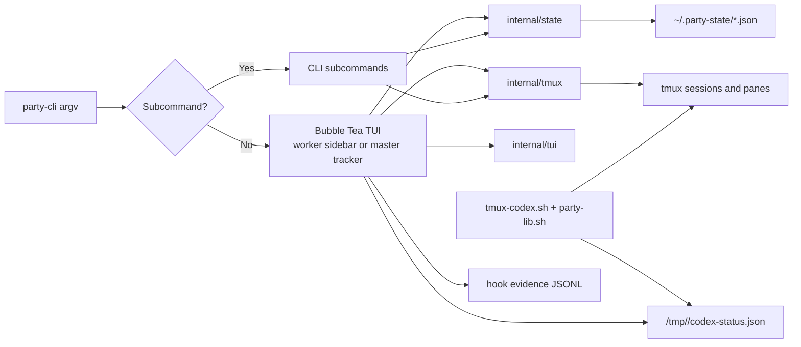
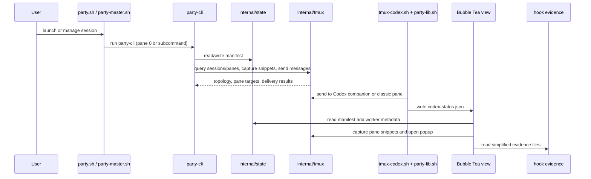

# Harness V2 — Simplification And Evolution Design

> **Specification:** [SPEC.md](./SPEC.md)

## Architecture Overview

Harness V2 now has one architectural center: `tools/party-cli/`. The root command owns mode selection. With no subcommand it launches Bubble Tea. With a subcommand it behaves as a normal CLI. The TUI and CLI must share the same state, tmux, and session packages, or the whole exercise degenerates into two codebases wearing one name.

The absorbed sidebar work is no longer a separate project track. Its surviving ideas become part of the unified binary:

- worker and standalone sessions show a sidebar in pane `0`
- master sessions show a tracker in pane `0`
- Codex leaves the visible layout and runs in a deterministic hidden companion tmux session, because `tmux-codex.sh` still needs a pane target and this plan does not port Codex transport
- `PARTY_LAYOUT=classic` preserves the old visible-Codex layout

### Diagram References

- [End-State Architecture](./diagrams/end-state-architecture.svg)
- [Session Layouts](./diagrams/session-layouts.svg)
- [Data Flow](./diagrams/data-flow.svg)
- [Before / After](./diagrams/before-after.svg)



The key constraint is honest coexistence. `party-cli` becomes the primary implementation surface, but `session/party-lib.sh` remains a deliberate shell dependency for `tmux-codex.sh`. The plan therefore retires duplicate Bash entrypoints, not every Bash library in the repository.

## Existing Standards (REQUIRED)

| Pattern | Location | How It Applies |
|---------|----------|----------------|
| Shared manifest persistence helpers | `session/party-lib.sh:67-213` | The Go state layer must preserve the current manifest contract instead of inventing a new schema up front |
| Session discovery and tmux-backed routing live in shared shell helpers today | `session/party-lib.sh:295-332`, `session/party-lib.sh:397-445` | The Go port should centralize discovery and routing once, not recreate ad hoc query logic in each command or TUI view |
| Pane-role metadata is the authoritative routing contract | `session/party.sh:140-150`, `session/party-master.sh:63-71`, `session/party-lib.sh:397-445` | Phase 1 may remove legacy fallback logic because the launchers already stamp `@party_role` on managed panes |
| Master and worker launch semantics are encoded in shell today | `session/party.sh:169-303`, `session/party-master.sh:5-84`, `session/party-master.sh:141-172` | The Go lifecycle port must preserve worker registration, master promotion, and resume behavior, not merely approximate them |
| Relay/report-back is a real workflow surface, not an incidental script | `session/party-relay.sh:7-8`, `session/party-relay.sh:45-51`, `session/party-relay.sh:215-218`, `claude/CLAUDE.md:88-92`, `claude/skills/party-dispatch/SKILL.md:103` | The migration must port `report` and worker enumeration, not just relay/broadcast |
| Tracker already has reusable Bubble Tea, width, and capture patterns | `tools/party-tracker/main.go:81-358`, `tools/party-tracker/main.go:427`, `tools/party-tracker/workers.go:65-153`, `tools/party-tracker/actions.go:24-66` | The new TUI should absorb these patterns rather than write a second tracker from first principles |
| Codex transport still depends on shell routing | `claude/skills/codex-transport/scripts/tmux-codex.sh:9`, `claude/skills/codex-transport/scripts/tmux-codex.sh:31`, `claude/skills/codex-transport/scripts/tmux-codex.sh:37` | `party-lib.sh` remains an explicit long-lived dependency boundary in this plan |
| Hook evidence remains append-only and session-scoped after simplification | `claude/hooks/lib/evidence.sh:157-305`, `docs/projects/phase-simplification/PLAN.md` | Sidebar evidence summaries should consume the simplified model rather than redesign it |

**Why these standards:** The repo already has durable contracts for manifests, pane roles, relay workflows, and Bubble Tea rendering patterns. The least foolish path is to harden those seams and then reimplement them in typed Go where appropriate, not to invent entirely new state and interaction models while the old shell flows still serve users.

## File Structure

```text
session/
├── party.sh                               # Modify later: thin wrapper and launch integration
├── party-master.sh                        # Modify later: thin wrapper and master launch integration
├── party-relay.sh                         # Modify later: wrapper or retirement after messaging parity
├── party-picker.sh                        # Modify later: wrapper or retirement after picker parity
├── party-preview.sh                       # Modify later: preview compatibility until picker cutover
└── party-lib.sh                           # Retained: Bash routing library for tmux-codex and classic shell paths

claude/hooks/
├── session-cleanup.sh                     # Modify: remove dead transition cleanup
├── agent-trace-stop.sh                    # Modify: delegate oscillation logic
├── worktree-guard.sh                      # Verify with new dedicated tests
└── lib/oscillation.sh                     # New: extracted oscillation helpers

claude/hooks/tests/
├── test-agent-trace.sh                    # Modify
└── test-worktree-guard.sh                 # New

tools/party-cli/
├── go.mod                                 # New
├── main.go                                # New
├── cmd/                                   # New: root and subcommands
├── internal/config/                       # New: env/config loading
├── internal/state/                        # New: manifest store, locking, discovery
├── internal/tmux/                         # New: session queries, pane lookup, capture, popup, send
├── internal/session/                      # New: lifecycle orchestration and companion naming
├── internal/message/                      # New: relay, broadcast, read, report workflows
├── internal/picker/                       # New later: picker state and preview integration
└── internal/tui/                          # New: Bubble Tea model, worker sidebar, master tracker

tools/party-tracker/
├── main.go                                # Migrate patterns from here into internal/tui
├── workers.go                             # Migrate data-read and snippet patterns into shared packages
└── actions.go                             # Migrate action patterns into shared services
```

**Legend:** `New` = create, `Modify` = edit existing, `Retained` = intentionally kept as a supported dependency

## Naming Conventions

| Entity | Pattern | Example |
|--------|---------|---------|
| Unified binary | `party-cli` | `party-cli list`, `party-cli stop`, `party-cli` |
| Companion Codex session | `<party-id>-codex` | `party-1774102277-codex` |
| TUI mode selection | derived from session context, with optional explicit flag | `party-cli --session party-1774102277` |
| Layout modes | explicit lower-case strings | `sidebar`, `classic` |
| Internal Go packages | single-responsibility nouns | `internal/state`, `internal/tmux`, `internal/tui` |
| Task docs | `TASK<N>-<kebab-case-title>.md` | `TASK12-build-worker-sidebar-view.md` |

Deterministic companion naming is deliberate. It avoids adding a new persisted manifest field merely to remember where Codex lives, while still letting routing, cleanup, and hidden-session filtering agree on one source of truth.

## Data Flow



Phase 1 improves the shell and hook path. Phase 2 rebuilds state, tmux, and TUI foundations in Go while shell entrypoints still exist. Phase 3 ports the command families and view behaviors, then trims the duplicate entrypoints once parity is proved.

## Data Transformation Points (REQUIRED)

| Layer Boundary | Code Path | Function | Input -> Output | Location |
|----------------|-----------|----------|-----------------|----------|
| argv -> mode selection | unified binary root | Cobra root `RunE` | `party-cli [args]` -> TUI launch or CLI subcommand | New in `tools/party-cli/cmd/root.go` |
| Shell launch config -> pane layout | session launchers | wrapper env/args -> `party-cli` pane, companion session, or classic codex pane | `session/party.sh:86-158`, `session/party-master.sh:5-84` |
| Manifest JSON -> typed domain state | shared state layer | manifest bytes -> `SessionManifest` | replaces `party_state_*` in `session/party-lib.sh:67-213` |
| tmux session list -> visible party sessions | discovery layer | tmux sessions + manifest presence -> visible sessions, excluding deterministic companions | replaces `discover_session()` in `session/party-lib.sh:295-332` |
| role request -> pane target | tmux routing layer | `session,role` -> `session:window.pane` or companion target | replaces current role helpers in `session/party-lib.sh:397-503` |
| send request -> delivery result | tmux service | payload + target -> explicit success, timeout, or tmux error | replaces `tmux_send()` in `session/party-lib.sh:347-390` |
| tracker/sidebar poll -> TUI view model | TUI layer | manifest state + worker list + pane snippets + status file + evidence summary -> render model | reuses patterns from `tools/party-tracker/main.go:81-358`, `tools/party-tracker/workers.go:65-153` |
| dispatch/completion -> Codex runtime status | retained shell transport | tmux-codex action -> `codex-status.json` | new runtime file consumed by worker sidebar |
| picker selection -> session action | picker layer | selected session row -> attach, continue, stop, or delete action | replaces `session/party-picker.sh:21-181` and `session/party-preview.sh:21-64` |

**New contracts must cross every affected seam.** In this revision that chiefly means:

- no-arg TUI mode must use the same state and tmux services as CLI mode
- companion-session naming must be shared by launch, routing, filtering, cleanup, and sidebar views
- `codex-status.json` must be written by retained shell transport and read by the Go sidebar

## Integration Points (REQUIRED)

| Point | Existing Code | New Code Interaction |
|-------|---------------|----------------------|
| Session launchers | `session/party.sh:169-303`, `session/party-master.sh:141-172` | Later tasks replace visible pane `0` processes with `party-cli`, while classic mode preserves current Codex layout |
| Bash routing library | `session/party-lib.sh:67-503` | Shared shell dependency remains for `tmux-codex.sh`; companion resolution and strict role routing live here for Bash-owned transport |
| Codex transport | `claude/skills/codex-transport/scripts/tmux-codex.sh:9-37` | Contract stays shell-owned; plan only adds clearer routing and runtime status writes needed by the sidebar |
| Relay/report-back workflows | `session/party-relay.sh:45-218` | Go messaging service must absorb the full surface, including `report` and worker enumeration, before wrappers are retired |
| Existing tracker module | `tools/party-tracker/main.go`, `tools/party-tracker/workers.go`, `tools/party-tracker/actions.go` | Reuse model/update/render structure, styling, and tmux action patterns inside `internal/tui` and shared packages |
| Absorbed sidebar project | `docs/projects/sidebar-tui/PLAN.md`, `docs/projects/sidebar-tui/DESIGN.md`, `docs/projects/sidebar-tui/SPEC.md` | Keep only the needed ideas: pane-0 sidebar, hidden companion Codex session, status file, popup peek, and classic fallback |
| Completed simplification baseline | `docs/projects/phase-simplification/PLAN.md` | Evidence model and phase simplification remain authoritative; Harness V2 only builds atop them |

## API Contracts

Harness V2 changes internal command and runtime contracts rather than external HTTP APIs.

```text
Unified binary:
  party-cli [--session <session-id>]        # no subcommand => Bubble Tea TUI
  party-cli list
  party-cli status <session-id>
  party-cli prune [--days N]
  party-cli start ...
  party-cli continue <session-id>
  party-cli stop <session-id>
  party-cli delete <session-id>
  party-cli promote <session-id>
  party-cli spawn --master <session-id> ...
  party-cli relay <worker-id> <message>
  party-cli broadcast <message>
  party-cli read <worker-id> [--lines N]
  party-cli report <message>
  party-cli workers <master-id>
  party-cli picker

Layout contract:
  PARTY_LAYOUT=sidebar|classic             # default sidebar for standard/worker sessions

Runtime artifacts:
  hidden companion session: <party-id>-codex
  status file: /tmp/<party-id>/codex-status.json
```

**Error classes**

| Condition | Surface | Meaning |
|-----------|---------|---------|
| `MISSING_DEPENDENCY` | stderr + exit 1 | Required tool such as `jq`, `tmux`, `go`, or `fzf` is absent for the chosen path |
| `SESSION_NOT_FOUND` | stderr + exit 1 | No current or requested party session can be resolved |
| `ROLE_NOT_FOUND` | stderr + exit 1 | No pane advertises the required `@party_role`, and no valid companion target exists |
| `ROLE_AMBIGUOUS` | stderr + exit 1 | More than one pane advertises the same role in one session |
| `DELIVERY_TIMEOUT` | stderr + non-zero exit | A tmux send did not complete within the configured timeout |
| `offline` | TUI state | Companion Codex session or status file is unavailable on the latest poll |

## Design Decisions

| Decision | Rationale | Alternatives Considered |
|----------|-----------|-------------------------|
| Use one binary for TUI and CLI | This converges the old tracker, sidebar, and CLI tracks into shared packages and one operator mental model | Separate tracker binary plus separate CLI (rejected: duplicates state/tmux logic) |
| Keep Codex transport shell-owned for now | `tmux-codex.sh` already depends on `party-lib.sh`; forcing a transport rewrite into this plan would bloat scope and reopen prior risks | Port Codex transport into Go now (rejected: too much surface for one roadmap) |
| Move Codex into a deterministic hidden companion session under sidebar mode | The sidebar needs pane `0`, yet `tmux-codex.sh` still needs a live target; deterministic naming avoids a new persisted manifest field | Keep visible Codex pane (rejected: defeats sidebar goal), add a manifest `codex_session` field (rejected: more state than needed) |
| Preserve `PARTY_LAYOUT=classic` | It gives a clean operational fallback while the new sidebar path proves itself in real work | Remove the old layout entirely (rejected: poor rollback story) |
| Port read paths before mutating paths | This establishes typed state, routing, and discovery with lower blast radius before lifecycle and messaging cutover | Port `start` first (rejected: too much risk before the shared services are trustworthy) |
| Absorb tracker patterns rather than rewrite them | The existing tracker already solves polling cadence, width adaptation, and core interaction loops | Write a new TUI from scratch (rejected: needless novelty) |
| Use `codex-status.json` as the bridge from retained shell transport to Go sidebar | It keeps Codex transport stable while giving the sidebar structured state instead of scrape-only heuristics | Parse Codex pane output only (rejected: brittle), port transport now (rejected: scope blowout) |

## External Dependencies

- **tmux 3.6a:** required for pane metadata, popup support, and the launch layouts already codified in `tmux/tmux.conf`.
- **jq:** required for the surviving shell manifest helpers and now enforced early instead of silently skipped.
- **Go 1.25.7:** matches the current tracker module and should remain the baseline for `party-cli`.
- **Cobra and Viper:** provide the shared root command and configuration seam.
- **Bubble Tea, Bubbles, Lip Gloss:** reused from the existing tracker patterns.
- **fzf:** optional convenience backend for picker parity; if absent, the binary must fail clearly or use a built-in fallback.
