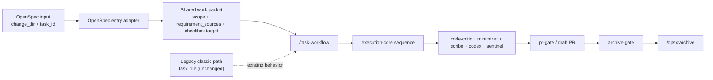
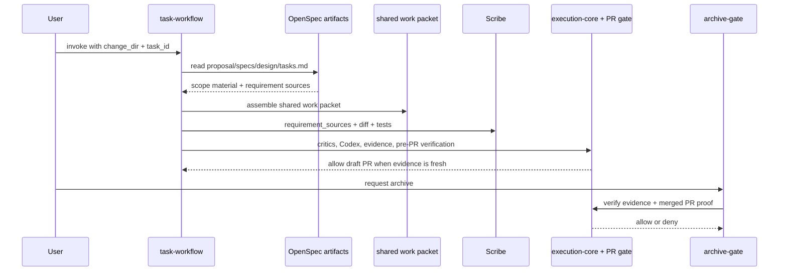

# OpenSpec Integration Into The Claude Code Harness Design

> **Specification:** [SPEC.md](./SPEC.md)

## Architecture Overview

Track 1 is OpenSpec-first. OpenSpec becomes the planning source of truth for the next feature project; the harness remains the execution governor. The existing classic `task_file` path remains in place as legacy behavior and is not the refactor target for this landing. The new work teaches `task-workflow` one OpenSpec entry shape:

- OpenSpec: `change_dir=<openspec/changes/<slug>>` plus `task_id=<n.m>`

When that shape is used, the entry step assembles the downstream work packet as follows:

- `scope_items` from the selected task heading path plus task text
- `out_of_scope` from proposal capability boundaries/exclusions, then design `Non-Goals`; if neither source yields negative boundaries, fail closed
- `checkbox_target` from the selected line in `tasks.md`
- `requirement_sources` from `proposal.md + specs/ + design.md + selected task`

From there the path is identical: `task-workflow -> critics -> Codex -> PR gate`. `scribe` extends to accept the OpenSpec requirement bundle while preserving its current TASK-file output shape. The legacy classic path continues through its existing behavior without new convergence work in Track 1.

The hard line remaineth simple: planning may move, execution doth not. `execution-core.md`, diff-hash evidence, critic/Codex review, and `pr-gate.sh` remain the only authoritative completion gates. Stock `/opsx:apply` is therefore unsupported for this harness, but the present hook surface cannot hard-block every third-party slash command; the blessed path must be documented honestly. `/opsx:archive` must remain downstream of the harness gates and require a terminal completion signal rather than mere PR readiness.



## Existing Standards (REQUIRED)

| Pattern | Location | How It Applies |
|---------|----------|----------------|
| Task execution assumes pre-read scope and checkbox state | `claude/skills/task-workflow/SKILL.md:20-25`, `claude/skills/task-workflow/SKILL.md:35-69`, `claude/skills/task-workflow/SKILL.md:84-94` | The OpenSpec path must produce the same scope and completion packet the existing TASK-file path already supplies before the execution sequence begins |
| Planning output is currently classic-only | `claude/skills/plan-workflow/SKILL.md:59-74`, `claude/skills/plan-workflow/SKILL.md:196-208`, `claude/skills/plan-workflow/SKILL.md:229-234` | Track 1 need not refactor classic planning first; OpenSpec handoff should be explicit in operator input and docs |
| Scribe is a requirement-to-diff auditor, not a style reviewer | `claude/agents/scribe.md:11-27`, `claude/agents/scribe.md:31-52` | OpenSpec integration should extend Scribe's requirement sources, not change its job |
| Execution order and gate authority already live in execution-core | `claude/rules/execution-core.md:9-13`, `claude/rules/execution-core.md:44-48`, `claude/rules/execution-core.md:97-98`, `claude/rules/execution-core.md:178-180` | OpenSpec may replace planning inputs, but not the review or evidence sequence |
| Diff-hash freshness ignores Markdown today | `claude/hooks/lib/evidence.sh:99-123`, `claude/hooks/lib/evidence.sh:276-304` | Checkbox edits in `tasks.md` and most planning-file churn will not invalidate evidence unless Task 5 changes that policy deliberately |
| PR readiness is enforced by a Bash PreToolUse hook | `claude/hooks/pr-gate.sh:30-89`, `claude/settings.json:84-112` | Archive gating should mirror this pattern, but add a terminal completion signal instead of pretending PR readiness equals archive readiness |
| Hook interception surface is narrow | `claude/settings.json:84-164` | Current hooks see Bash and Skill events, not arbitrary third-party slash commands, so OpenSpec control points must be wrappers and blessed entrypoints |
| Worker dispatch still emits TASK-file prompts | `claude/skills/party-dispatch/SKILL.md:133-138` | OpenSpec worker dispatch should be a follow-up, not accidental hidden scope in Track 1 |

**Why these standards:** The harness already has a good execution spine. The least foolish path is to add a narrow OpenSpec adapter, preserve the review and evidence spine, defer worker-dispatch follow-up, and refuse the temptation to distribute mode checks throughout the workflow docs.

## File Structure

```text
claude/
├── agents/
│   └── scribe.md                        # Modify
├── hooks/
│   ├── archive-gate.sh                  # New
│   ├── lib/
│   │   └── evidence.sh                  # Modify later if markdown policy changes
│   └── tests/
│       ├── test-archive-gate.sh         # New
│       ├── test-openspec-routing.sh     # New
│       ├── test-pr-gate.sh              # Modify
│       └── test-evidence.sh             # Modify later if markdown policy changes
├── rules/
│   └── execution-core.md                # Modify
├── skills/
│   ├── bugfix-workflow/
│   │   └── SKILL.md                     # Modify later for final routing notes
│   ├── plan-workflow/
│   │   └── SKILL.md                     # Modify later for final routing notes
│   ├── quick-fix-workflow/
│   │   └── SKILL.md                     # Modify later for final routing notes
│   └── task-workflow/
│       └── SKILL.md                     # Modify
└── settings.json                        # Modify
```

**Legend:** `New` = create, `Modify` = edit existing

## Naming Conventions

| Entity | Pattern | Example |
|--------|---------|---------|
| OpenSpec task input | explicit change reference | `change_dir=openspec/changes/foo`, `task_id=1.2` |
| Shared work packet fields | explicit, stable names | `scope_items`, `out_of_scope`, `checkbox_target`, `requirement_sources` |
| OpenSpec negative scope sources | explicit derivation order | `proposal.md` exclusions/capability boundaries -> `design.md` `Non-Goals` -> fail closed if absent |
| Optional task metadata extension | backward-compatible, opt-in block | `<!-- harness: {...} -->` or equivalent, only if Task 5 proves it necessary |

## Data Flow



## Data Transformation Points (REQUIRED)

| Layer Boundary | Code Path | Function | Input -> Output | Location |
|----------------|-----------|----------|-----------------|----------|
| Workflow input -> work packet | Classic (legacy) | existing TASK-file path | Existing TASK file behavior remains intact in Track 1 | `claude/skills/task-workflow/SKILL.md:20-25` remains the legacy reference point |
| Workflow input -> work packet | OpenSpec | `assemble_work_packet(change_dir, task_id)` | `proposal.md` capability boundaries/exclusions + `design.md` `Non-Goals` + selected task heading path/text + `specs/` -> `{scope_items, out_of_scope, checkbox_target, requirement_sources}` | Extends `claude/skills/task-workflow/SKILL.md:20-25` without a repo-mode detector |
| Work packet -> review prompts | Shared | `build_scope_prompt()` | shared work packet -> critic/Codex/Sentinel prompt block | Replaces TASK-file-only prompt assumptions in `claude/skills/task-workflow/SKILL.md:40-62`, `claude/skills/task-workflow/SKILL.md:77-82` |
| Requirement sources -> numbered ledger | Shared | `assemble_requirement_sources()` | TASK file or OpenSpec bundle -> numbered requirements and out-of-scope ledger | Extends `claude/agents/scribe.md:21-44` |
| Branch diff -> evidence hash | Shared | `compute_diff_hash()` | merge-base diff -> `clean`, `unknown`, or SHA-256 | `claude/hooks/lib/evidence.sh:99-123` |
| Archive request -> allow/deny | OpenSpec | `archive_gate()` | archive attempt + merged-PR lookup + session evidence -> allow/deny with missing markers | Mirrors `claude/hooks/pr-gate.sh:55-86`, adds `gh pr view --json state,mergedAt`, and registers beside it in `claude/settings.json:84-112` |

**Silent-drop risk:** the selected OpenSpec task must carry enough scope for reviewers to reject creep, but the full behavioral requirements must still come from proposal/specs/design. That is Path B by design. Do not try to cram the whole spec back into `tasks.md`, and do not try to make `design.md` the behavioral source of truth. If proposal/design provide no explicit negative boundaries, fail closed rather than inventing `out_of_scope`.

## Integration Points (REQUIRED)

| Point | Existing Code | New Code Interaction |
|-------|---------------|----------------------|
| Planning handoff | `claude/skills/plan-workflow/SKILL.md:59-74`, `claude/skills/plan-workflow/SKILL.md:196-208` | OpenSpec feature planning hands off explicitly as `change_dir + task_id`; classic planning remains legacy and is not re-plumbed in Track 1 |
| Task execution entry | `claude/skills/task-workflow/SKILL.md:20-25`, `claude/skills/task-workflow/SKILL.md:39-46`, `claude/skills/task-workflow/SKILL.md:84-94` | `task-workflow` adds an OpenSpec adapter and keeps the legacy TASK-file path intact |
| Requirements audit | `claude/agents/scribe.md:11-27`, `claude/agents/scribe.md:31-52` | Scribe accepts `requirement_sources` backed either by a TASK file or by an OpenSpec artifact bundle |
| Review and evidence spine | `claude/rules/execution-core.md:9-13`, `claude/rules/execution-core.md:178-180`, `claude/hooks/lib/evidence.sh:185-304`, `claude/hooks/pr-gate.sh:55-86` | No new sequence; only the planning input shape changes |
| Workflow variants | `claude/skills/bugfix-workflow/SKILL.md:18-20`, `claude/skills/quick-fix-workflow/SKILL.md:27-47`, `claude/skills/party-dispatch/SKILL.md:133-138` | Bugfix and quick-fix remain separate explicit routes; OpenSpec worker dispatch is deferred and documented as follow-up |

## API Contracts

The harness changes internal workflow contracts rather than external HTTP APIs.

```text
task-workflow Track 1 inputs:

1. OpenSpec (new work)
   change_dir: openspec/changes/<slug>
   task_id: 1.2

Existing legacy behavior remains in place:
   task_file: docs/projects/<slug>/tasks/TASKN-....md

Shared downstream work packet:
  scope_items: selected task heading path + selected task text
  out_of_scope: proposal capability boundaries/exclusions -> design Non-Goals -> fail closed if absent
  checkbox_target: selected checkbox in tasks.md (OpenSpec) OR existing TASK file path (legacy path)
  requirement_sources:
    - proposal.md
    - design.md
    - specs/
    - selected task reference
    OR
    - TASK file (legacy path)

scribe accepted inputs:
  requirement_sources = TASK file
  OR
  requirement_sources = {proposal, design, specs_dir, task_id, task_text}
```

**Errors**

| Condition | Surface | Meaning |
|-----------|---------|---------|
| `INPUT_SHAPE_INVALID` | workflow error | Neither the OpenSpec input shape nor the legacy TASK-file path was provided |
| `OPENSPEC_CHANGE_NOT_FOUND` | workflow error | `openspec/changes/<slug>/` does not exist |
| `OPENSPEC_TASK_NOT_FOUND` | workflow error | `tasks.md` does not contain the selected task id |
| `OPENSPEC_ARTIFACT_MISSING` | workflow error | `proposal.md`, `design.md`, or required spec deltas are missing |
| `OPENSPEC_SCOPE_SOURCE_MISSING` | workflow error | Proposal/design do not provide the negative scope sources needed to derive `out_of_scope` safely |
| `OPENSPEC_APPLY_BLOCKED` | wrapper/skill guidance | Stock OpenSpec execution was attempted instead of harness execution |
| `OPENSPEC_ARCHIVE_BLOCKED` | archive gate | Archive attempted before required evidence exists or before the associated PR is merged |

## Design Decisions

| Decision | Rationale | Alternatives Considered |
|----------|-----------|-------------------------|
| Add a narrow OpenSpec entry adapter instead of repo-mode detection | This localizes new branching to the OpenSpec entry seam and keeps the rest of the harness singular | Auto-detect repo mode everywhere (rejected: spreads conditionals through every skill) |
| Keep one downstream execution path | Critics, Codex, evidence, and PR gating already work. The harness should not branch below the OpenSpec adapter | Separate classic and OpenSpec execution flows (rejected: duplication and drift) |
| Do not build a Bash OpenSpec parser library | Claude already reads Markdown natively. The useful contract is accepted inputs and required artifacts, not another shell shim | `claude/hooks/lib/openspec.sh` parser (rejected: over-engineered) |
| Use Path B for requirement assembly | `scribe` should reconstruct requirements from proposal + specs + design + selected task, because OpenSpec tasks are intentionally lightweight and the richer behavioral truth already exists elsewhere | Fork `tasks.md` into a verbose TASK-clone (rejected: redundant and brittle) |
| Keep task state in one file in Track 1 | Checkbox sync becomes simpler when OpenSpec completion updates only `openspec/changes/<slug>/tasks.md` | Recreate per-task TASK files inside OpenSpec projects (rejected: shadow planning system) |
| Keep the classic TASK-file path untouched in Track 1 | The immediate goal is OpenSpec execution, not classic-path convergence. Legacy behavior can remain until real usage proves whether deletion or convergence is warranted | Refactor classic and OpenSpec together on day one (rejected: broader landing than needed) |
| Keep Markdown excluded from diff-hash in Track 1 | Current evidence semantics already ignore Markdown (`claude/hooks/lib/evidence.sh:100`), which means checkbox edits do not stale evidence while the design settles | Include `openspec/**/*.md` in diff-hash immediately (rejected for Track 1: churn without a policy decision) |
| Use wrappers and hooks, not mythical slash-command interception | Current hooks only see Bash and Skill events (`claude/settings.json:84-164`). The pragmatic path is blessed entrypoints, explicit unsupported-path warnings, and downstream archive enforcement | Spend Track 1 chasing unsupported third-party slash-command interception (rejected: no present hook surface) |
| Require merged-PR state for archive | PR readiness and archive readiness are different states; archive must prove the change actually landed | Reuse PR-readiness evidence alone (rejected: archives unmerged work) |

## External Dependencies

- **OpenSpec artifact contract:** `openspec/changes/<slug>/{proposal.md,design.md,tasks.md,specs/}` must remain the upstream layout the harness reads.
- **Git + jq + shasum:** already required by `evidence.sh` and `pr-gate.sh`; OpenSpec gating should reuse the same shell stack.
- **GitHub CLI auth:** archive-gate must be able to inspect merged PR state, likely via `gh pr view --json state,mergedAt`.
- **Claude skill and hook surfaces:** current enforcement can route through Bash and Skill hooks only, per `claude/settings.json:84-164`.
- **Optional OpenSpec metadata extension:** only introduced in Task 5 if stock `tasks.md` proves insufficient after the input-shape design exists.
