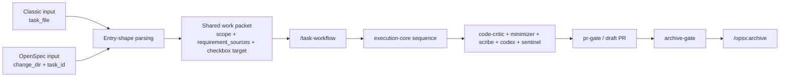
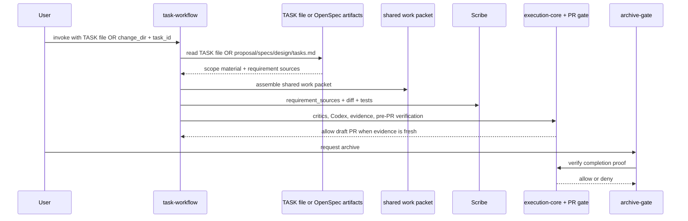

# OpenSpec Integration Into The Claude Code Harness Design

> **Specification:** [SPEC.md](./SPEC.md)

## Architecture Overview

OpenSpec becomes the planning source of truth for the next feature project; the harness remains the execution governor. The clean seam is explicit input shape, not repo detection. `task-workflow` shall accept exactly one of two entry shapes:

- classic: `task_file=<TASK*.md>`
- OpenSpec: `change_dir=<openspec/changes/<slug>>` plus `task_id=<n.m>`

That entry step assembles the same downstream work packet: scope boundaries, checkbox target, and requirement sources. From there the path is identical: `task-workflow -> critics -> Codex -> PR gate`. `scribe` likewise accepts one `requirement_sources` contract that can be backed either by a TASK file or by the OpenSpec bundle of `proposal.md + specs/ + design.md + selected task`.

The hard line remaineth simple: planning may move, execution doth not. `execution-core.md`, diff-hash evidence, critic/Codex review, and `pr-gate.sh` remain the only authoritative completion gates. Stock `/opsx:apply` is therefore not an execution path for this harness, and `/opsx:archive` must remain downstream of the harness gates rather than beside them.



## Existing Standards (REQUIRED)

| Pattern | Location | How It Applies |
|---------|----------|----------------|
| Task execution assumes pre-read scope and checkbox state | `claude/skills/task-workflow/SKILL.md:20-25`, `claude/skills/task-workflow/SKILL.md:35-69`, `claude/skills/task-workflow/SKILL.md:84-94` | Both accepted input shapes must produce the same scope and completion packet before the execution sequence begins |
| Planning output is currently classic-only | `claude/skills/plan-workflow/SKILL.md:59-74`, `claude/skills/plan-workflow/SKILL.md:196-208`, `claude/skills/plan-workflow/SKILL.md:229-234` | OpenSpec handoff should be explicit in operator input and docs, not hidden behind repo detection |
| Scribe is a requirement-to-diff auditor, not a style reviewer | `claude/agents/scribe.md:11-27`, `claude/agents/scribe.md:31-52` | OpenSpec integration should extend Scribe's requirement sources, not change its job |
| Execution order and gate authority already live in execution-core | `claude/rules/execution-core.md:9-13`, `claude/rules/execution-core.md:44-48`, `claude/rules/execution-core.md:97-98`, `claude/rules/execution-core.md:178-180` | OpenSpec may replace planning inputs, but not the review or evidence sequence |
| Diff-hash freshness ignores Markdown today | `claude/hooks/lib/evidence.sh:99-123`, `claude/hooks/lib/evidence.sh:276-304` | Checkbox edits in `tasks.md` and most planning-file churn will not invalidate evidence unless Task 5 changes that policy deliberately |
| PR readiness is enforced by a Bash PreToolUse hook | `claude/hooks/pr-gate.sh:30-89`, `claude/settings.json:84-112` | Archive gating should mirror this pattern instead of inventing a second informal checklist |
| Hook interception surface is narrow | `claude/settings.json:84-164` | Current hooks see Bash and Skill events, not arbitrary third-party slash commands, so OpenSpec control points must be wrappers and blessed entrypoints |

**Why these standards:** The harness already has a good execution spine. The least foolish path is to localize branching at the entry seam, preserve the review and evidence spine, and refuse the temptation to distribute mode checks throughout the workflow docs.

## File Structure

```text
claude/
├── agents/
│   └── scribe.md                        # Modify
├── hooks/
│   ├── archive-gate.sh                  # New
│   ├── lib/
│   │   └── evidence.sh                  # Modify later if markdown policy changes
│   └── tests/
│       ├── test-archive-gate.sh         # New
│       ├── test-openspec-routing.sh     # New
│       ├── test-pr-gate.sh              # Modify
│       └── test-evidence.sh             # Modify later if markdown policy changes
├── rules/
│   └── execution-core.md                # Modify
├── skills/
│   ├── bugfix-workflow/
│   │   └── SKILL.md                     # Modify later for final routing notes
│   ├── plan-workflow/
│   │   └── SKILL.md                     # Modify
│   ├── quick-fix-workflow/
│   │   └── SKILL.md                     # Modify later for final routing notes
│   └── task-workflow/
│       └── SKILL.md                     # Modify
└── settings.json                        # Modify
```

**Legend:** `New` = create, `Modify` = edit existing

## Naming Conventions

| Entity | Pattern | Example |
|--------|---------|---------|
| Classic task input | explicit file reference | `task_file=docs/projects/foo/tasks/TASK3-bar.md` |
| OpenSpec task input | explicit change reference | `change_dir=openspec/changes/foo`, `task_id=1.2` |
| Shared work packet fields | explicit, stable names | `scope_items`, `out_of_scope`, `checkbox_target`, `requirement_sources` |
| Optional task metadata extension | backward-compatible, opt-in block | `<!-- harness: {...} -->` or equivalent, only if Task 5 proves it necessary |

## Data Flow



## Data Transformation Points (REQUIRED)

| Layer Boundary | Code Path | Function | Input -> Output | Location |
|----------------|-----------|----------|-----------------|----------|
| Workflow input -> work packet | Classic | `assemble_work_packet(task_file)` | TASK file -> `{scope_items, out_of_scope, checkbox_target, requirement_sources}` | Extends the current TASK-file-only assumptions in `claude/skills/task-workflow/SKILL.md:20-25` |
| Workflow input -> work packet | OpenSpec | `assemble_work_packet(change_dir, task_id)` | `proposal.md + specs/ + design.md + selected task` -> `{scope_items, out_of_scope, checkbox_target, requirement_sources}` | Replaces the need for a separate mode detector while extending `claude/skills/task-workflow/SKILL.md:20-25` |
| Work packet -> review prompts | Shared | `build_scope_prompt()` | shared work packet -> critic/Codex/Sentinel prompt block | Replaces TASK-file-only prompt assumptions in `claude/skills/task-workflow/SKILL.md:40-62`, `claude/skills/task-workflow/SKILL.md:77-82` |
| Requirement sources -> numbered ledger | Shared | `assemble_requirement_sources()` | TASK file or OpenSpec bundle -> numbered requirements and out-of-scope ledger | Extends `claude/agents/scribe.md:21-44` |
| Branch diff -> evidence hash | Shared | `compute_diff_hash()` | merge-base diff -> `clean`, `unknown`, or SHA-256 | `claude/hooks/lib/evidence.sh:99-123` |
| Archive request -> allow/deny | OpenSpec | `archive_gate()` | archive attempt + session evidence -> allow/deny with missing markers | Mirrors `claude/hooks/pr-gate.sh:55-86` and registers beside it in `claude/settings.json:84-112` |

**Silent-drop risk:** the selected OpenSpec task must carry enough scope for reviewers to reject creep, but the full behavioral requirements must still come from proposal/specs/design. That is Path B by design. Do not try to cram the whole spec back into `tasks.md`, and do not try to make `design.md` the behavioral source of truth.

## Integration Points (REQUIRED)

| Point | Existing Code | New Code Interaction |
|-------|---------------|----------------------|
| Planning handoff | `claude/skills/plan-workflow/SKILL.md:59-74`, `claude/skills/plan-workflow/SKILL.md:196-208` | OpenSpec feature planning hands off explicitly as `change_dir + task_id`; classic planning still hands off explicitly as `task_file` |
| Task execution entry | `claude/skills/task-workflow/SKILL.md:20-25`, `claude/skills/task-workflow/SKILL.md:39-46`, `claude/skills/task-workflow/SKILL.md:84-94` | `task-workflow` accepts either input shape and localizes branching to the entry parse only |
| Requirements audit | `claude/agents/scribe.md:11-27`, `claude/agents/scribe.md:31-52` | Scribe accepts `requirement_sources` backed either by a TASK file or by an OpenSpec artifact bundle |
| Review and evidence spine | `claude/rules/execution-core.md:9-13`, `claude/rules/execution-core.md:178-180`, `claude/hooks/lib/evidence.sh:185-304`, `claude/hooks/pr-gate.sh:55-86` | No new sequence; only the planning input shape changes |
| Workflow variants | `claude/skills/bugfix-workflow/SKILL.md:18-20`, `claude/skills/quick-fix-workflow/SKILL.md:27-47` | Bugfix and quick-fix remain separate explicit routes; final docs need only say so plainly, not detect repo mode |

## API Contracts

The harness changes internal workflow contracts rather than external HTTP APIs.

```text
task-workflow accepted inputs (exactly one shape):

1. Classic
   task_file: docs/projects/<slug>/tasks/TASKN-....md

2. OpenSpec
   change_dir: openspec/changes/<slug>
   task_id: 1.2

Shared downstream work packet:
  scope_items: [...]
  out_of_scope: [...]
  checkbox_target: TASK file path OR selected checkbox in tasks.md
  requirement_sources:
    - TASK file
    OR
    - proposal.md
    - design.md
    - specs/
    - selected task reference

scribe accepted inputs:
  requirement_sources = TASK file
  OR
  requirement_sources = {proposal, design, specs_dir, task_id, task_text}
```

**Errors**

| Condition | Surface | Meaning |
|-----------|---------|---------|
| `INPUT_SHAPE_INVALID` | workflow error | Neither accepted input shape was provided, or both were provided at once |
| `OPENSPEC_CHANGE_NOT_FOUND` | workflow error | `openspec/changes/<slug>/` does not exist |
| `OPENSPEC_TASK_NOT_FOUND` | workflow error | `tasks.md` does not contain the selected task id |
| `OPENSPEC_ARTIFACT_MISSING` | workflow error | `proposal.md`, `design.md`, or required spec deltas are missing |
| `OPENSPEC_APPLY_BLOCKED` | wrapper/skill guidance | Stock OpenSpec execution was attempted instead of harness execution |
| `OPENSPEC_ARCHIVE_BLOCKED` | archive gate | Archive attempted before required evidence exists |

## Design Decisions

| Decision | Rationale | Alternatives Considered |
|----------|-----------|-------------------------|
| Use explicit input-shape polymorphism instead of repo-mode detection | This localizes branching to the first few lines of the workflow and keeps the rest of the harness singular | Auto-detect repo mode everywhere (rejected: spreads conditionals through every skill) |
| Keep one downstream execution path | Critics, Codex, evidence, and PR gating already work. The harness should not branch below the entry seam | Separate classic and OpenSpec execution flows (rejected: duplication and drift) |
| Do not build a Bash OpenSpec parser library | Claude already reads Markdown natively. The useful contract is accepted inputs and required artifacts, not another shell shim | `claude/hooks/lib/openspec.sh` parser (rejected: over-engineered) |
| Use Path B for requirement assembly | `scribe` should reconstruct requirements from proposal + specs + design + selected task, because OpenSpec tasks are intentionally lightweight and the richer behavioral truth already exists elsewhere | Fork `tasks.md` into a verbose TASK-clone (rejected: redundant and brittle) |
| Keep task state in one file in Track 1 | Checkbox sync becomes simpler when OpenSpec completion updates only `openspec/changes/<slug>/tasks.md` | Recreate per-task TASK files inside OpenSpec projects (rejected: shadow planning system) |
| Keep classic TASK-file input for now | Explicit classic input remains clean enough without repo detection. Remove it later only if real implementation proves it less elegant than deletion | Retire classic inputs immediately (deferred, not chosen first) |
| Keep Markdown excluded from diff-hash in Track 1 | Current evidence semantics already ignore Markdown (`claude/hooks/lib/evidence.sh:100`), which means checkbox edits do not stale evidence while the design settles | Include `openspec/**/*.md` in diff-hash immediately (rejected for Track 1: churn without a policy decision) |
| Use wrappers and hooks, not mythical slash-command interception | Current hooks only see Bash and Skill events (`claude/settings.json:84-164`). The pragmatic path is blessed entrypoints plus downstream gate enforcement | Spend Track 1 chasing unsupported third-party slash-command interception (rejected: no present hook surface) |

## External Dependencies

- **OpenSpec artifact contract:** `openspec/changes/<slug>/{proposal.md,design.md,tasks.md,specs/}` must remain the upstream layout the harness reads.
- **Git + jq + shasum:** already required by `evidence.sh` and `pr-gate.sh`; OpenSpec gating should reuse the same shell stack.
- **Claude skill and hook surfaces:** current enforcement can route through Bash and Skill hooks only, per `claude/settings.json:84-164`.
- **Optional OpenSpec metadata extension:** only introduced in Task 5 if stock `tasks.md` proves insufficient after the input-shape design exists.
