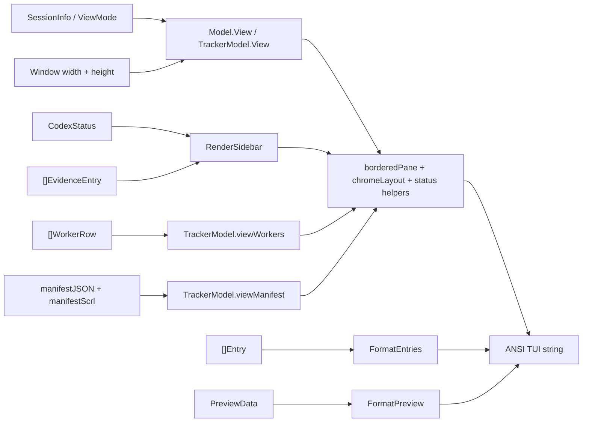
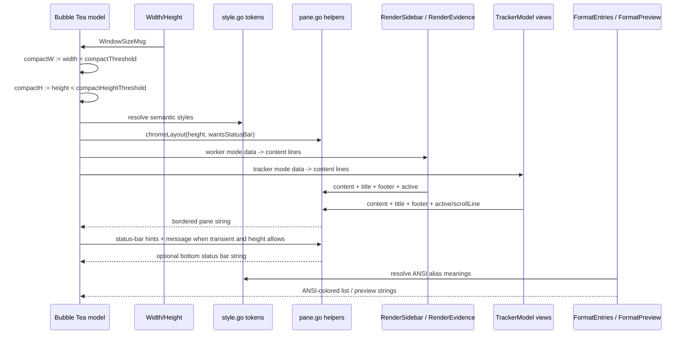

# party-cli TUI Style Match Design

> **Specification:** [SPEC.md](./SPEC.md)

## Architecture Overview

This change does not alter `party-cli`'s data model or command surface. It changes the render contract around the existing worker and master views, and it aligns the adjacent `fzf` picker formatting seam to the same terminal-theme-safe palette. The operative idea is simple enough: port scry's chrome vocabulary into local `party-cli` helpers, then route the current worker sidebar, tracker list, manifest viewer, tracker composer, and picker output through those helpers or their raw ANSI equivalent.

The least foolish path is not to "look inspired by scry." It is to make the render primitives materially equivalent where it matters:

- the same semantic token names and values
- the same rounded bordered pane structure
- the same full-row reverse selection model
- the same bordered-pane chrome vocabulary
- a footer-first steady-state layout so narrow or short tmux panes do not collapse under extra chrome
- a flat-list worker sidebar interior that matches the tracker's rhythm instead of creating a faux inner form
- a three-tier worker sidebar hierarchy: bright section headers, muted or semantic detail lines, dimmest help text
- the same faint and italic treatment for low-priority text
- a readable inactive-title tier in the tracker so non-selected workers do not dissolve into the same gray as snippets and footer text
- picker ANSI colors that inherit the terminal theme instead of fighting it with bespoke RGB escapes

`party-cli` keeps one local exception: the master identity accent remains gold, but only inside title text, not as a separate border system.



## Existing Standards (REQUIRED)

| Pattern | Location | How It Applies |
|---------|----------|----------------|
| Semantic theme token vocabulary | `~/Code/scry/internal/ui/theme/theme.go:8-25` | `party-cli` should rename and expand its palette to scry's token names and exact ANSI values so later styling reads the same way across both tools |
| Rounded bordered pane helper with embedded title/footer | `~/Code/scry/internal/ui/panes/border.go:11-119` | `party-cli` should add a local helper with the same visual output and optional scroll indicator instead of open-coded rules |
| Full-row reverse selection | `~/Code/scry/internal/ui/panes/filelist.go:16-18`, `~/Code/scry/internal/ui/panes/filelist.go:148-181`, `~/Code/scry/internal/ui/panes/dashboard.go:15-20`, `~/Code/scry/internal/ui/panes/dashboard.go:67-94` | Tracker rows should stop highlighting only the cursor/name and instead reverse the whole selected row while keeping `▸` |
| Status bar and key badge system | `~/Code/scry/internal/ui/statusbar.go:14-20`, `~/Code/scry/internal/ui/statusbar.go:48-95`, `~/Code/scry/internal/ui/statusbar.go:166-180`, `~/Code/scry/internal/ui/idle.go:126-133` | `party-cli` should reuse the badge language, but reserve a full-width status bar for transient errors or active input modes rather than append one unconditionally to every surface |
| Spinner + accent treatment | `~/Code/scry/internal/ui/model.go:136-139` | Worker "working" state should use an accent-colored spinner/dot rather than plain green text alone |
| Typography hierarchy | `~/Code/scry/internal/ui/panes/filelist.go:18`, `~/Code/scry/internal/ui/panes/filelist.go:35`, `~/Code/scry/internal/ui/idle.go:45-46`, `~/Code/scry/internal/ui/panes/patch.go:429-448`, `~/Code/scry/internal/ui/model.go:1560-1592` | `party-cli` should use bright sidebar labels, muted/semantic worker values, readable inactive tracker titles, faint snippets/footer text, and italic for special notes such as offline/stale/unavailable annotations |
| Current party-cli render seams | `tools/party-cli/internal/tui/style.go:7-30`, `tools/party-cli/internal/tui/model.go:219-300`, `tools/party-cli/internal/tui/sidebar.go:11-96`, `tools/party-cli/internal/tui/tracker.go:249-390` | These are the minimum-impact TUI files to change; the restyle should stay inside the TUI layer |
| Current compact-width contract | `tools/party-cli/internal/tui/style.go:29-30`, `tools/party-cli/internal/tui/model.go:293-300`, `tools/party-cli/internal/tui/tracker.go:249-255` | The project should preserve the `compactThreshold` semantics rather than invent a new width regime during a styling pass |
| Current views do not own vertical space once extra chrome is added | `tools/party-cli/internal/tui/model.go:219-276`, `tools/party-cli/internal/tui/tracker.go:257-361` | The helper layer must define explicit height budgets before worker/tracker views adopt extra borders and transient status bars |
| Current picker formatting uses hardcoded RGB ANSI strings | `tools/party-cli/internal/picker/fzf.go:13-72` | Replace RGB escape codes with ANSI 4/2/8/240-aligned values so the picker inherits terminal theme settings like the rest of the tool family |
| Picker data shaping is separate from picker formatting | `tools/party-cli/internal/picker/picker.go:40-218` | Inspect `picker.go` for related formatting, but keep Task 4 focused on the raw ANSI output layer unless a tiny constant/helper extraction is materially cleaner |

**Why these standards:** `scry` already solved the visual problems `party-cli` presently has. Reusing the same render grammar is lower risk and more coherent than inventing another TUI style. The deliberate divergences are pragmatic: `party-cli` keeps the gold master text accent, uses a footer-first steady-state layout so short tmux panes do not lose too many rows to chrome, and leaves the picker as raw ANSI text because that is the least disruptive fit for `fzf`.

## File Structure

```text
tools/party-cli/internal/tui/
├── style.go              # Modify: rename palette to scry tokens, add sidebar label/value/help styles, inactive-title style, width/height thresholds
├── pane.go               # New: local bordered pane, border line, content dimensions, chrome-layout helpers
├── pane_test.go          # New: bordered pane, ANSI title, truncation, and status/helper tests
├── model.go              # Modify: worker shell + error shell adopt bordered pane and height-aware footer/status behavior
├── sidebar.go            # Modify: worker body adopts flat-list layout, section/detail hierarchy, and evidence sub-list styling
├── tracker.go            # Modify: tracker pane chrome, reverse selection, manifest pane, composer chrome
├── model_test.go         # Modify: wide/compact/short-height worker chrome assertions
├── sidebar_test.go       # Modify: compact sidebar and typography assertions
└── tracker_test.go       # Modify: reverse-row selection, inactive-title hierarchy, manifest chrome, composer/footer assertions

tools/party-cli/internal/picker/
├── fzf.go                # Modify: replace hardcoded RGB ANSI escapes with scry-aligned ANSI token usage
├── picker.go             # Inspect: keep data shaping unchanged unless a tiny constant/helper extraction is materially cleaner
└── picker_test.go        # Modify: add or update formatting assertions for ANSI-themed list and preview output

docs/projects/tui-style-match/
├── SPEC.md               # Modify
├── DESIGN.md             # Modify
├── PLAN.md               # Modify
├── mockups/
│   ├── sidebar-wide.svg
│   ├── sidebar-compact.svg
│   ├── tracker-wide.svg
│   └── tracker-compact.svg
└── tasks/
    ├── TASK1-add-scry-theme-tokens-and-pane-chrome.md
    ├── TASK2-restyle-worker-sidebar-shell.md
    ├── TASK3-restyle-master-tracker-manifest-and-composer.md
    └── TASK4-align-party-picker-ansi-theme.md
```

**Legend:** `New` = create, `Modify` = edit existing, `Inspect` = confirm no-change unless a tiny cleanup is justified

## Naming Conventions

| Entity | Pattern | Example |
|--------|---------|---------|
| Theme tokens | Match scry semantic names | `Accent`, `Muted`, `StatusBg` |
| party-specific exception | Keep explicit custom name | `gold` |
| Sidebar semantic styles | reflect label/value/help tier | `sidebarLabelStyle`, `sidebarValueStyle`, `sidebarHelpStyle` |
| Pane helpers | lowerCamelCase local helpers | `borderedPane`, `borderedPaneWithScroll`, `contentDimensions` |
| Status bar keys | small render structs or helper args | `renderStatusBar(width, hints, message, err)` |
| Selected row styles | describe state, not color | `selectedRowStyle`, `selectedRowAccentStyle` |
| Height threshold | explicit compact rule | `compactHeightThreshold = 14` |
| Picker ANSI aliases | map raw escape strings to token meaning | `pickerAccentANSI`, `pickerMutedANSI` |

## Color Contract

| Token | Value | Source | Planned Use |
|-------|-------|--------|-------------|
| `Added` | ANSI `2` | `~/Code/scry/internal/ui/theme/theme.go:10` | Positive status markers, approval/evidence success |
| `Deleted` | ANSI `1` | `~/Code/scry/internal/ui/theme/theme.go:11` | Error and stopped-state semantics |
| `HunkHeader` | ANSI `6` | `~/Code/scry/internal/ui/theme/theme.go:12` | Secondary highlight when a cyan accent is helpful; available for manifest headings if needed |
| `Clean` | ANSI `2` | `~/Code/scry/internal/ui/theme/theme.go:15` | Active/success dots and positive semantic values |
| `Dirty` | ANSI `3` | `~/Code/scry/internal/ui/theme/theme.go:16` | Warnings, `NEEDS_DISCUSSION`, `REQUEST_CHANGES` |
| `Error` | ANSI `1` | `~/Code/scry/internal/ui/theme/theme.go:17` | Errors and destructive actions |
| `Accent` | ANSI `4` | `~/Code/scry/internal/ui/theme/theme.go:20` | Active pane border, spinner, active chrome, picker preview headers |
| `Muted` | ANSI `8` | `~/Code/scry/internal/ui/theme/theme.go:21` | Inactive borders, metadata values, picker column separators, footer/snippet base tone |
| `StatusBg` | ANSI `235` | `~/Code/scry/internal/ui/theme/theme.go:22` | Bottom status bar and key badges |
| `StatusFg` | ANSI `252` | `~/Code/scry/internal/ui/theme/theme.go:23` | Default status-bar foreground, bright sidebar labels, and readable non-selected tracker title tone |
| `DividerFg` | ANSI `240` | `~/Code/scry/internal/ui/theme/theme.go:24` | Optional separators inside the status bar and dim picker section separators |
| `BrightText` | ANSI `15` | `~/Code/scry/internal/ui/theme/theme.go:25` | Key badge foreground and scroll indicator |
| `InactiveTitle` | Alias of `StatusFg` (ANSI `252`) | Derived from `~/Code/scry/internal/ui/theme/theme.go:23` | Inactive tracker worker titles that must remain readable above snippets/footer |
| `SidebarLabel` | Alias of `StatusFg` (ANSI `252`) | Derived from `~/Code/scry/internal/ui/theme/theme.go:23` | Worker/sidebar section headers such as `Codex` and `Evidence` |
| `SidebarValue` | Alias of `Muted` (ANSI `8`) | Derived from `~/Code/scry/internal/ui/theme/theme.go:21` | Plain worker value lines such as title/cwd plus indented worker detail lines when no semantic status color applies |
| `gold` | Hex `#ffd700` | `tools/party-cli/internal/tui/style.go:13` | Master label text only |

## Style Mapping (Source Of Truth Reconciliation)

| Pattern | scry Source | Current party-cli | Planned party-cli |
|---------|-------------|-------------------|-------------------|
| Theme token names and values | `~/Code/scry/internal/ui/theme/theme.go:8-25` | `blue/green/yellow/red/dim/gold` in `tools/party-cli/internal/tui/style.go:7-27` | Replace ad hoc names with the scry token set; keep `gold` as an explicit local exception |
| Rounded pane borders | `~/Code/scry/internal/ui/panes/border.go:11-119` | Horizontal rules only in `tools/party-cli/internal/tui/model.go:240`, `tools/party-cli/internal/tui/model.go:269`, `tools/party-cli/internal/tui/tracker.go:272`, `tools/party-cli/internal/tui/tracker.go:337`, `tools/party-cli/internal/tui/tracker.go:369`, `tools/party-cli/internal/tui/tracker.go:385` | Add local bordered pane helpers and route worker, tracker, and manifest shells through them |
| Embedded title/footer | `~/Code/scry/internal/ui/panes/border.go:36-45`, `~/Code/scry/internal/ui/panes/border.go:70-93` | Separate header/footer lines with plain text | Move view labels and passive metadata into the pane border itself |
| Scroll indicator | `~/Code/scry/internal/ui/panes/border.go:19-67`, `~/Code/scry/internal/ui/model.go:1639-1655` | No scroll indicator in manifest viewer | Add right-edge scroll indicator for manifest overflow; leave worker and tracker list bodies without bespoke scroll chrome for now |
| Reverse selection | `~/Code/scry/internal/ui/panes/filelist.go:17`, `~/Code/scry/internal/ui/panes/dashboard.go:18` | Blue bold name plus `▸` only in `tools/party-cli/internal/tui/tracker.go:278-316` | Keep `▸`, but reverse the entire selected row and status cell |
| Footer vs status-bar roles | `~/Code/scry/internal/ui/panes/border.go:39-45`, `~/Code/scry/internal/ui/statusbar.go:48-95`, `~/Code/scry/internal/ui/idle.go:126-133` | Plain dim footer text in `tools/party-cli/internal/tui/model.go:270-273` and `tools/party-cli/internal/tui/tracker.go:354-358` | Use pane footers for passive metadata and steady-state hints; reserve a separate status bar for transient errors or active input when height allows |
| Worker sidebar flat-list hierarchy | `~/Code/scry/internal/ui/panes/filelist.go:148-181`, `~/Code/scry/internal/ui/panes/dashboard.go:67-94`, `~/Code/scry/internal/ui/theme/theme.go:20-25` | `tools/party-cli/internal/tui/sidebar.go:19-96` reads like a rigid key-value form inside the pane | Render title/cwd as direct value lines, `Codex` and `Evidence` as section headers, and details as indented muted or semantic sub-lines so the worker pane flows like the tracker rather than a form |
| Typography hierarchy | `~/Code/scry/internal/ui/panes/filelist.go:18`, `~/Code/scry/internal/ui/panes/filelist.go:35`, `~/Code/scry/internal/ui/panes/patch.go:443-448` | Mostly plain foreground colors | Use readable inactive worker titles (`StatusFg`), then dim/faint snippets and footer text, with bold only for active/selected emphasis |
| Picker ANSI color alignment | `~/Code/scry/internal/ui/theme/theme.go:20-25` | Hardcoded RGB in `tools/party-cli/internal/picker/fzf.go:17-22`, `tools/party-cli/internal/picker/fzf.go:33-69` | Keep raw ANSI strings for `fzf`, but replace RGB values with ANSI 4/2/8/240 mappings that inherit terminal theme |
| Split/layout precedent | `~/Code/scry/internal/ui/dashboard.go:531-543` | Single-column worker and tracker views; raw `fzf` picker | Do not force a new split layout into narrow tmux panes or rewrite the picker around Lip Gloss; adopt the chrome and token contract, not the dashboard IA |

## Exact Lip Gloss Code

```go
var (
    Added      = lipgloss.Color("2")
    Deleted    = lipgloss.Color("1")
    HunkHeader = lipgloss.Color("6")

    Clean      = Added
    Dirty      = lipgloss.Color("3")
    Error      = lipgloss.Color("1")

    Accent     = lipgloss.Color("4")
    Muted      = lipgloss.Color("8")
    StatusBg   = lipgloss.Color("235")
    StatusFg   = lipgloss.Color("252")
    DividerFg  = lipgloss.Color("240")
    BrightText = lipgloss.Color("15")

    gold = lipgloss.Color("#ffd700")

    paneTitleStyle           = lipgloss.NewStyle().Foreground(Accent).Bold(true)
    masterTitleStyle         = lipgloss.NewStyle().Foreground(gold).Bold(true)
    sidebarLabelStyle        = lipgloss.NewStyle().Foreground(StatusFg)
    sidebarValueStyle        = lipgloss.NewStyle().Foreground(Muted)
    sidebarHelpStyle         = lipgloss.NewStyle().Foreground(Muted).Faint(true)
    activeTextStyle          = lipgloss.NewStyle().Foreground(Clean)
    warnTextStyle            = lipgloss.NewStyle().Foreground(Dirty)
    errorTextStyle           = lipgloss.NewStyle().Foreground(Error)
    dimTextStyle             = lipgloss.NewStyle().Foreground(Muted).Faint(true)
    noteTextStyle            = lipgloss.NewStyle().Foreground(Muted).Italic(true)
    inactiveWorkerTitleStyle = lipgloss.NewStyle().Foreground(StatusFg)
    selectedRowStyle         = lipgloss.NewStyle().Reverse(true)
    selectedRowTitleStyle    = lipgloss.NewStyle().Reverse(true).Bold(true)
    inactiveBorderStyle      = lipgloss.NewStyle().Foreground(Muted)
    activeBorderStyle        = lipgloss.NewStyle().Foreground(Accent)
    scrollIndicatorStyle     = lipgloss.NewStyle().Foreground(BrightText)
    statusBarStyle           = lipgloss.NewStyle().Background(StatusBg).Foreground(StatusFg)
    statusBarErrorStyle      = lipgloss.NewStyle().Background(Error).Foreground(BrightText)
    keyBadgeStyle            = lipgloss.NewStyle().Background(StatusBg).Foreground(BrightText).Padding(0, 1)
    keyLabelStyle            = lipgloss.NewStyle().Foreground(Muted)
    segmentSepStyle          = lipgloss.NewStyle().Foreground(DividerFg)
    spinnerStyle             = lipgloss.NewStyle().Foreground(Accent)
    snippetStyleWide         = lipgloss.NewStyle().Foreground(Muted).Faint(true).PaddingLeft(3)
    snippetStyleCompact      = lipgloss.NewStyle().Foreground(Muted).Faint(true).PaddingLeft(2)
)

const (
    compactThreshold       = 50
    compactHeightThreshold = 14
)
```

### Picker ANSI Contract

The picker should remain raw ANSI text because `fzf` already expects it, but the escape strings should stop pretending RGB is a virtue:

```go
const (
    pickerResetANSI   = "\033[0m"
    pickerAccentANSI  = "\033[34m"      // ANSI 4
    pickerCleanANSI   = "\033[32m"      // ANSI 2
    pickerMutedANSI   = "\033[90m"      // ANSI 8
    pickerDividerANSI = "\033[38;5;240m" // ANSI 240
)
```

Planned usage:

- `FormatEntries()` column separators use `pickerMutedANSI`
- `FormatEntries()` resumable separator row uses `pickerDividerANSI` or `pickerMutedANSI`
- `FormatPreview()` master header and `--- Paladin ---` use `pickerAccentANSI`
- `FormatPreview()` active state and prompt line use `pickerCleanANSI`
- `FormatPreview()` resumable state, cwd, timestamp, Claude/Codex IDs use `pickerMutedANSI`

## Border Helper API

The helper should stay local to `party-cli`, but its behavior should mirror `scry` closely enough that the same mental model applies:

```go
func borderedPane(content, title, footer string, outerWidth, outerHeight int, active bool) string
func borderedPaneWithScroll(content, title, footer string, outerWidth, outerHeight int, active bool, scrollLine int) string
func contentDimensions(outerWidth, outerHeight int) (int, int)
func chromeLayout(totalHeight int, wantsStatusBar bool) (bodyHeight int, showStatusBar bool)
func renderStatusBar(width int, hints []keyHint, message string, err error) string
```

## Height Ownership

The helper layer must own vertical space explicitly before the views adopt extra chrome. The current worker and tracker renderers simply write lines until they are done (`tools/party-cli/internal/tui/model.go:219-276`, `tools/party-cli/internal/tui/tracker.go:257-361`), which is tolerable only because today they pay almost no chrome overhead.

Planned policy:

- `compactHeightThreshold = 14`
- Footer-only pane states always reserve exactly 2 rows of chrome: top border + bottom border
- Separate full-width status bars are allowed only when `height >= compactHeightThreshold`
- When a separate status bar is active, the view must reserve exactly 3 rows of chrome: top border + bottom border + status bar

Therefore:

- Footer-only body budget: `outerHeight - 2`
- Pane + status-bar body budget: `outerHeight - 3`

Steady-state worker and tracker views stay footer-only. Transient worker errors and active tracker input modes may enable the separate status bar only when height permits. Below `compactHeightThreshold`, those hints/errors collapse back into the pane footer.

## Data Flow



## Data Transformation Points (REQUIRED)

| Layer Boundary | Code Path | Function | Input -> Output | Location |
|----------------|-----------|----------|-----------------|----------|
| Session resolution -> worker shell title/footer | Worker | `Model.View()` | `SessionInfo + ViewMode + Width/Height` -> bordered worker pane + footer-only steady state or pane+status transient state | Current seam: `tools/party-cli/internal/tui/model.go:219-276` |
| Codex domain state -> worker status lines | Worker | `RenderSidebar()` | `CodexStatus` -> flat-list worker lines: section header plus indented muted/semantic detail line | Current seam: `tools/party-cli/internal/tui/sidebar.go:11-67` |
| Evidence domain state -> worker summary lines | Worker | `RenderEvidence()` | `[]EvidenceEntry` -> section header plus indented summary lines with semantic result values | Current seam: `tools/party-cli/internal/tui/sidebar.go:70-96` |
| Worker rows -> tracker list rows | Tracker | `TrackerModel.viewWorkers()` | `[]WorkerRow + cursor + width` -> bordered worker-list pane rows with reverse-selected row, readable inactive titles, and dim snippets | Current seam: `tools/party-cli/internal/tui/tracker.go:257-361` |
| Tracker mode/input -> composer chrome | Tracker | `TrackerModel.viewWorkers()` | `trackerMode + input.Value() + height` -> bordered composer or compact inline fallback, with status bar only when height allows | Current seam: `tools/party-cli/internal/tui/tracker.go:343-359` |
| Manifest JSON + scroll -> manifest viewport | Tracker manifest | `TrackerModel.viewManifest()` | `manifestJSON + manifestScrl + height` -> bordered manifest pane + footer or optional status bar + scroll indicator | Current seam: `tools/party-cli/internal/tui/tracker.go:364-392` |
| Width/height -> compact chrome decisions | Shared | `Model.innerWidth()`, `TrackerModel.innerWidth()`, `compactThreshold`, `compactHeightThreshold` | `Width/Height` -> truncation budget, footer-only vs pane+status budget, compact/wide branch | `tools/party-cli/internal/tui/style.go:29-30`, `tools/party-cli/internal/tui/model.go:293-300`, `tools/party-cli/internal/tui/tracker.go:249-255` |
| Picker entries -> `fzf` row string | Picker | `FormatEntries()` | `[]Entry` -> ANSI-colored fixed-width picker rows with muted column separators and divider-colored resumable separator | Current seam: `tools/party-cli/internal/picker/fzf.go:13-26` |
| Picker preview data -> ANSI preview string | Picker | `FormatPreview()` | `*PreviewData` -> ANSI-colored preview text using Accent/Clean/Muted token alignment | Current seam: `tools/party-cli/internal/picker/fzf.go:28-72` |

No persisted fields or transport adapters change shape in this project. The transformation points above are all render-stage conversions from domain state to styled strings.

## Integration Points (REQUIRED)

| Point | Existing Code | New Code Interaction |
|-------|---------------|----------------------|
| Theme definitions | `tools/party-cli/internal/tui/style.go:7-27` | Replace the ad hoc palette with scry token names and add sidebar label/value/help, inactive-title, footer, border, and status styles |
| Worker shell | `tools/party-cli/internal/tui/model.go:219-276` | Swap flat headers/footers for a bordered pane with footer-first steady-state hints and explicit short-height fallback |
| Error shell | `tools/party-cli/internal/tui/model.go:279-290` | Re-render as a bordered error pane; use a separate status bar only when height >= `compactHeightThreshold`, otherwise fold the message into the footer |
| Worker sidebar body | `tools/party-cli/internal/tui/sidebar.go:11-96` | Remove hard-coded left gutters and render a flat list body with direct value lines, bright section headers, muted/semantic detail lines, and dim/faint help text |
| Tracker list shell | `tools/party-cli/internal/tui/tracker.go:257-361` | Apply bordered pane chrome, reverse-row selection, readable inactive-title styling, and footer-first hint treatment |
| Manifest viewer | `tools/party-cli/internal/tui/tracker.go:364-392` | Convert to bordered pane with scroll indicator and explicit height budgeting for footer-only vs pane+status states |
| Picker list formatting | `tools/party-cli/internal/picker/fzf.go:13-26` | Replace hardcoded RGB escape strings with ANSI 8/240-aligned separators while preserving fixed-width layout |
| Picker preview formatting | `tools/party-cli/internal/picker/fzf.go:28-72` | Replace hardcoded RGB preview/status/header colors with ANSI 4/2/8-aligned theme usage |
| Existing tests | `tools/party-cli/internal/tui/model_test.go:165-197`, `tools/party-cli/internal/tui/sidebar_test.go:228-250`, `tools/party-cli/internal/tui/tracker_test.go:181-219`, `tools/party-cli/internal/tui/tracker_test.go:641-705`, `tools/party-cli/internal/picker/picker_test.go:1-331` | Update expectations from plain strings to bordered/footer-first chrome, add ANSI-aware helper tests, assert reverse styling beyond cursor presence, and add picker-format assertions |

## API Contracts

No external CLI, tmux, or manifest contract changes are introduced. The only new contracts are internal render helpers and style invariants:

```text
Worker view:
  [bordered pane body]
  [embedded footer with passive metadata + steady-state hints]
  [optional status bar only for transient errors when height >= 14]

Worker body layout rule:
  title/cwd = plain value lines
  section headers = StatusFg
  codex details = indented line with muted/semantic segments
  evidence details = indented sub-list

Worker typography rule:
  section headers = StatusFg
  direct value lines and detail lines = Muted unless semantic status applies
  semantic values = Clean / Dirty / Error / Muted as appropriate
  help/footer text = Muted + Faint

Tracker view:
  [bordered pane body]
  [embedded footer with passive metadata + steady-state hints]
  [optional status bar only for active input or transient errors when height >= 14]

Manifest view:
  [bordered pane body with optional right-edge scroll indicator]
  [embedded footer with passive metadata]
  [optional status bar only if the surface enters a transient state and height >= 14]

Picker list:
  resumable separator = DividerFg or Muted ANSI
  column separators = Muted ANSI

Picker preview:
  master/header text = Accent ANSI
  active/prompt text = Clean ANSI
  resumable/cwd/timestamp/id text = Muted ANSI

Width rule:
  compact := width < 50

Height rule:
  compactHeightThreshold := 14
  if height < 14: no separate status bar; footer absorbs hints/errors
  if height >= 14 and status bar is active: bodyHeight = outerHeight - 3
  else: bodyHeight = outerHeight - 2

Tracker typography rule:
  selected row = Reverse(true)
  inactive worker titles = StatusFg
  snippets/footer/help text = Muted + Faint
```

## Design Decisions

| Decision | Rationale | Alternatives Considered |
|----------|-----------|-------------------------|
| Create a local `party-cli` border helper that ports scry's pane semantics | Directly importing `scry` is needless cross-repo coupling. A local helper keeps `party-cli` independent while preserving the exact visual behavior from `~/Code/scry/internal/ui/panes/border.go:11-119` | Keep open-coded rules (rejected: too much duplication), import scry package directly (rejected: cross-repo dependency) |
| Keep `compactThreshold` at `50` and add `compactHeightThreshold = 14` | Current worker/tracker views already subtract four columns for gutters via `innerWidth()` (`tools/party-cli/internal/tui/model.go:293-300`, `tools/party-cli/internal/tui/tracker.go:249-255`), so horizontal space is recoverable, but current views do not budget vertical chrome at all (`tools/party-cli/internal/tui/model.go:219-276`, `tools/party-cli/internal/tui/tracker.go:257-361`). The added height threshold makes the row cost explicit before the new chrome lands | Increase width threshold only (rejected: misses the real vertical risk), ignore height entirely (rejected: review already proved that is unsound) |
| Give the worker sidebar a flat-list interior plus explicit section/detail/help tiers | The present worker sidebar renders too much information on the same dim tier and compounds the problem with a rigid inner form layout (`tools/party-cli/internal/tui/sidebar.go:19-96`). Direct value lines plus section headers and indented detail lines make it feel like the tracker instead of a separate component family | Keep the rigid form layout and only recolor it (rejected: still feels structurally wrong), keep one mostly-dim tier (rejected: poor scanability), make all values bright (rejected: no hierarchy) |
| Give the manifest viewer bordered treatment | The manifest view is the only current tracker subview that truly scrolls, so it benefits most from the bordered title/footer and right-edge scroll indicator from `scry` | Leave manifest as plain JSON with rules (rejected: visually inconsistent and wastes the scroll-indicator affordance) |
| Use embedded pane footers for steady-state metadata and hints; reserve a full-width status bar for transient errors or active input only | This preserves the scry family resemblance while reducing layout churn and row loss in short panes. It also matches the fact that `party-cli` needs constant key hints but not a permanently separate status line on every surface | Full-width status bar everywhere (rejected: too expensive vertically), footer-only for all states including active input/errors (rejected: tall panes can afford clearer transient affordances) |
| Use a bordered composer in standard widths, compact inline fallback only when space is genuinely scarce | This matches scry's use of bordered sub-panels for focused interaction while avoiding absurdly expensive chrome in very tight panes | Keep the current inline `r> input` prompt everywhere (rejected: visually weakest surface in the tracker), force bordered composer at all sizes (rejected: too costly below ~40 columns / 14 rows) |
| Preserve gold only inside master title text, not as border color | The active-pane border should remain `Accent` blue so `party-cli` still reads as scry family. Gold remains as a local identity cue on the `Master` label or title token | Gold border for master mode (rejected: breaks family resemblance), remove gold entirely (rejected: unnecessary loss of identity) |
| Introduce a readable inactive-title tier in the tracker using `StatusFg` | The current tracker uses one dim tier for too many things (`tools/party-cli/internal/tui/style.go:21-26`, `tools/party-cli/internal/tui/tracker.go:279-329`), which makes non-selected worker names collapse into snippets and footer text. A `StatusFg` title tier preserves hierarchy without competing with the reverse-selected row | Keep inactive titles on `Muted` (rejected: unreadable wall of gray), use `BrightText` everywhere (rejected: too loud) |
| Keep picker styling as raw ANSI strings, but align those strings to scry tokens | `fzf` already expects raw ANSI strings and the current fixed-width formatting depends on them. Replacing RGB literals with ANSI 4/2/8/240 gives terminal-theme inheritance without dragging the picker through a larger rendering rewrite | Keep hardcoded RGB (rejected: token drift and theme mismatch), rewrite picker with Lip Gloss (rejected: needless scope growth) |

## Specific Questions Resolved

1. **Should party-cli adopt scry's `BorderedPane()` helper directly, or create its own?**
   Create its own local helper in `tools/party-cli/internal/tui/pane.go`, but port scry's semantics nearly verbatim. The behavior should mirror `~/Code/scry/internal/ui/panes/border.go:11-119`, with only the API kept local to avoid repo coupling.

2. **How to handle the narrow tmux pane constraint?**
   Keep `compactThreshold = 50`, add `compactHeightThreshold = 14`, and make chrome height-aware. Borders are acceptable horizontally because the current views already burn four columns on fixed gutters. Vertically, short panes must stay footer-only: no separate status bar, body rows = `outerHeight - 2`. Taller panes may spend the extra row on a transient status bar only when input or errors justify it.

3. **Should the manifest viewer get bordered treatment?**
   Yes. It should be the first `party-cli` surface to use `borderedPaneWithScroll(...)`, because it is already a scrollable overlay and gains the most clarity from a titled border and right-edge scroll indicator.

4. **Should the input mode (relay/broadcast/spawn) get a bordered input field?**
   Yes in standard widths/heights; no in truly cramped panes. Use a bordered composer when `width >= 40` and `height >= 14`. When height is sufficient, active input may also claim the full-width status bar for send/cancel hints; below that threshold, the hints collapse into the pane footer.

5. **How to handle the gold master title within scry's blue-accent scheme?**
   Keep borders and active chrome blue (`Accent`). Render only the `Master` title token in gold inside the pane title text. That preserves identity without inventing a second accent system.

## ASCII Mockups

### Worker Sidebar, Wide

Reference image: `./mockups/sidebar-wide.svg`

Visual hierarchy: title/cwd render as plain `Muted` value lines; `Codex` and `Evidence` headers use `StatusFg`; indented details use `Muted` or semantic colors; footer/help text = `Muted` + `Faint`.

```text
╭─ Worker: party-worker-17 ────────────────────────────────────────────╮
│ tui style match                                                      │
│ ~/Code/ai-config                                                     │
│                                                                      │
│ Codex ⠋ working                                                      │
│   review · DESIGN.md · 00:02:14                                      │
│                                                                      │
│ Evidence                                                             │
│   review  REQUEST_CHANGES                                            │
│   tests   APPROVED                                                   │
╰─ 2 evidence items · q quit · p peek codex ───────────────────────────╯
```

### Worker Sidebar, Compact / Short Height

Reference image: `./mockups/sidebar-compact.svg`

Height-aware behavior: this example assumes `< 14` rows, so there is no separate status bar; hints stay in the pane footer and body rows are budgeted as `outerHeight - 2`. The same flat-list interior still applies, merely compressed.

```text
╭─ party-worker-17 / worker ─────────────────╮
│ tui style match                            │
│ ~/Code/ai-config                           │
│ Codex idle                                 │
│   APPROVE · 12s ago                        │
│ Evidence                                   │
│   review REQUEST_CHANGES                   │
╰─ 2 evidence · q quit · p peek ─────────────╯
```

### Master Tracker, Wide

Reference image: `./mockups/tracker-wide.svg`

Visual hierarchy: selected row = reverse, inactive worker titles = readable `StatusFg`, snippets/footer = `Muted` + `Faint`.

```text
╭─ Master: party-master-1 ─────────────────────────────────────────────╮
│ ▸ worker-a                               ● active                    │
│   ⏺ reviewing tui/style.go                                          │
│                                                                      │
│   worker-b                               ○ stopped                   │
│   · last verdict: REQUEST_CHANGES                                    │
│                                                                      │
│   worker-c                               ● active                    │
│   · running go test ./tools/party-cli/internal/tui/...               │
╰─ 3 workers · j/k nav · enter attach · r relay · s spawn · m manifest ╯
```

### Master Tracker, Compact / Short Height

Reference image: `./mockups/tracker-compact.svg`

Height-aware behavior: this example assumes a short pane, so steady-state hints stay in the pane footer and inactive titles remain brighter than any omitted/dim metadata.

```text
╭─ Master: party-master-1 ─────────────────╮
│ ▸ task-a                           ●     │
│   task-b                           ○     │
│   task-c                           ●     │
╰─ 3 workers · j/k · ↵ · r · b · s · m · q ╯
```

### Tall Transient State

When height is at least `compactHeightThreshold`, transient worker errors and active tracker input modes may append a separate full-width status bar. In those states the body budget drops to `outerHeight - 3` rows.

## External Dependencies

- `github.com/charmbracelet/lipgloss` already powers both `party-cli` and `scry`; this change only uses more of the existing API surface.
- `github.com/charmbracelet/bubbletea` remains the render host; no event model changes are needed.
- `fzf` already expects ANSI-formatted text; Task 4 only changes which ANSI codes are emitted.
- `~/Code/scry/` remains a source-of-truth reference repo, not a build dependency.
